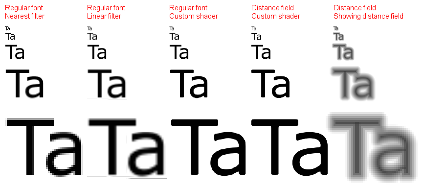

# react-vr-fonts

> Popular fonts in SDF format for React VR apps

## Web fonts in VR

Rendering text in any 3D environment is considerably harder than on a 2D web page. HTML was built specifically to display text whereas a 3D application is more concerned with displaying geometry. Only recently have the two begun to intermingle with the rise in popularity of VR. Suddenly the idea of UIs in 3D space went from a Hollywood pipe dream to something achievable in the near future. Of course, this brings in a new set of challenges.

One of the biggest issues with text in 3D is that large amounts of it can get quite computationally expensive if it's rendered as geometry. Instead text is usually rendered as a texture (static image) with the downside that when scaled or rotated it may look blurry. 
[SDF fonts](http://www.valvesoftware.com/publications/2007/SIGGRAPH2007_AlphaTestedMagnification.pdf) (Signed Distance Field) come to fill in this gap. By using a simple processing technique they allow font glyphs to remain sharp at multiple levels of magnification.


<center>Image from <a href="https://github.com/libgdx/libgdx/wiki/Distance-field-fonts">libgdx/wiki/Distance-field-fonts</a></center>

React VR has it's own SDF format implementation and comes out of the box with the `Oculus Sans` font. Users are free to generate SDF versions of any font by using the [fontue](https://github.com/facebook/react-vr/tree/master/tools/fontue) tool. 

To make things a bit easier, this repo provides already converted SDF fonts. If you find that your favorite font isn't included here, please [contribute](#how-to-contribute)!

## How to use

For now you'll have to manually copy the font files to your app folder. Unfortunately there's no way to distribute them as an NPM package because [Metro Bundler](https://github.com/facebook/metro-bundler) will not include them in the [production release](https://github.com/facebook/react-vr/issues/52#issuecomment-312746787).

### Load a single font

```js
import {VRInstance} from 'react-vr-web';
import * as OVRUI from 'ovrui';

function init(bundle, parent, options) {
  OVRUI.loadFont(
    '../static_assets/Lobster.fnt',
    '../static_assets/Lobster_sdf.png'
  ).then(font => {
    const vr = new VRInstance(bundle, 'CustomFont', parent, {
      font: font,
      ...options
    });
    vr.render = function() {};
    vr.start();
  });
}

window.ReactVR = {init};
```
A full working example can be found [here](https://github.com/RadValentin/react-vr-samples/tree/master/src/CustomFont).

### Load multiple fonts as fallbacks

At this time React VR doesn't allow setting a font face on individual text elements. This means that you can't have one block of text rendered with `Arial` and another with `Comic Sans`. You'll have to use a single character font.

However if your fonts cover different Unicode ranges (ex: character font + icon font) then you could combine them by loading one as a fallback.

```js
import {VRInstance} from 'react-vr-web';
import * as OVRUI from 'ovrui';

function init(bundle, parent, options) {
  Promise.all([
    OVRUI.loadFont(
      '../static_assets/Lobster.fnt',
      '../static_assets/Lobster_sdf.png'
    ),
    OVRUI.loadFont(
      '../static_assets/FontAwesome.fnt',
      '../static_assets/FontAwesome_sdf.png'
    )
  ]).then(([lobsterFont, fontAwesome]) => {
    // If a glyph isn't in FontAwesome then we fallback to Lobster
    OVRUI.addFontFallback(lobsterFont, fontAwesome);

    const vr = new VRInstance(bundle, 'CustomFontFallback', parent, {
      font: lobsterFont,
      ...options
    });
    vr.render = function() {};
    vr.start();
  });
}

window.ReactVR = {init};
```

A full working example can be found [here](https://github.com/RadValentin/react-vr-samples/tree/master/src/CustomFontFallback).

## How to convert a font on macOS

1. Clone the [react-vr](https://github.com/facebook/react-vr) repo, you'll need to work in its `/tools/fontue` directory
    ```
    $ git clone git@github.com:facebook/react-vr.git
    $ cd react-vr/tools/fontue/
    ```
1. Get [homebrew](https://brew.sh/)
1. Install cmake and freetype
    ```
    $ brew install cmake
    $ brew install freetype
    ```
1. Build the fontue tool
    ```
    $ cmake .
    $ make
    ```
1. Run the tool it takes arguments in the format below (see [notes](#notes) for examples)
    ```
    ./fontue <in font file> <out font file > [[-option], ... ]
    ```
    
### Notes

[EEFIGS](https://en.wiktionary.org/wiki/EFIGS) fonts in this repo are generated by setting an Unicode range (`-ur` param) that covers most latin characters:

```
./fontue ~/fonts/Lobster-1.4.otf ~/fonts/Lobster -co -0.01 -ts 1.0 -hpad 128 -vpad 128 -sdf 512 -1 -1 -ur 0x0010 0x00ff -ur 0x0370 0x03FF -ur 0x0100 0x017F -ur 0x0180 0x024F
```

For an icon font you'll have to figure out what range it uses and it if overlaps with EEFIGS glyphs. For example `Font Awesome` uses a range between `0xf000` and `0xf2e0`.

```
./fontue ~/fonts/font-awesome/FontAwesome-4.7.0.otf ~/fonts/font-awesome/FontAwesome -co -0.01 -ts 1.0 -hpad 128 -vpad 128 -sdf 512 -1 -1 -ur 0xf000 0xf2e0
```

## How to contribute

Do you want to use a certain font but it's not included in this repo? Have you successfully [converted](#how-to-convert-a-font-on-macos) a font and want to add it here? Just submit a pull request, all contributions are more than welcome!